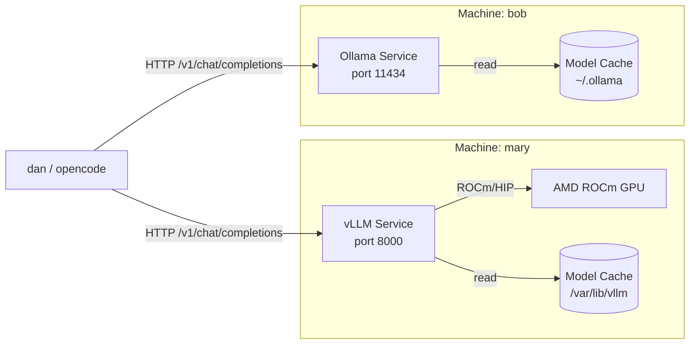
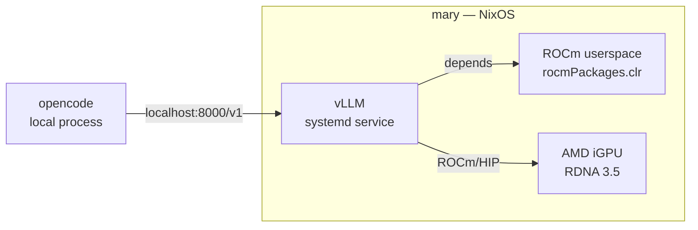
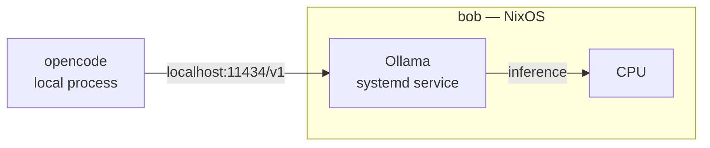

## Context

Two NixOS machines run local LLM inference: **mary** (Framework AMD AI 300 laptop with ROCm-compatible iGPU) and **bob** (CPU-only desktop). Both currently run Ollama. OpenCode has no local provider configured — it defaults to remote API calls. This design introduces a heterogeneous inference stack: vLLM on mary for GPU-accelerated throughput, Ollama retained on bob for CPU-optimized inference.



Two system context views per machine:

**mary (vLLM):**


**bob (Ollama):**


## Goals / Non-Goals

**Goals:**
- vLLM running as a NixOS systemd service on mary with ROCm GPU detection
- Replace Ollama on mary entirely (no coexistence)
- Bob remains on Ollama, unchanged
- OpenCode provider config pointing to local endpoint per machine
- Firewall port 8000 opened on mary for vLLM API access
- Module follows existing `dpom-<name>.enable` pattern matching the repo conventions

**Non-Goals:**
- Tuning vLLM parameters for specific models (deferred to post-deploy)
- GPU support on bob (no hardware)
- High availability or load balancing
- Model download automation beyond what vLLM's built-in download provides
- Performance benchmarking

## Decisions

### 1. NixOS module structure (modeled on ollama.nix)

Mirror the existing `modules/nixos/ollama.nix` pattern for consistency:

| Aspect | ollama.nix | vllm.nix |
|---|---|---|
| Option name | `dpom-ollama` | `dpom-vllm` |
| Enable | `mkEnableOption` | `mkEnableOption` |
| Acceleration | `rocm` or `null` | `rocm` or `null` |
| ROCm override | `rocmGfxOverride` | `rocmGfxOverride` |
| Model list | `loadModels` | `model` (single) or `models` (list) |
| Service | `services.ollama` (NixOS built-in) | custom `systemd.services.vllm` |
| Port | 11434 (Ollama default) | 8000 (vLLM default) |
| GPU packages | `hardware.graphics` with `rocmPackages.*` | same pattern |

**Why not Docker/Podman?** `pkgs.vllm` exists in nixpkgs at v0.16.0, making a native NixOS service simpler and more maintainable than OCI containers — no container runtime dependency, direct ROCm integration, consistent with the existing Ollama approach.

**Why not a Python venv?** The nixpkgs derivation handles ROCm/CUDA variants, dependency resolution, and version pinning. A venv would duplicate this work and drift from the NixOS declarative model.

### 2. ROCm support on mary

The Framework AMD AI 300 series has an RDNA 3.5 iGPU. ROCm support for this generation is provided by:
- `rocmPackages.clr` — Compute Language Runtime (OpenCL/HIP)
- `rocmPackages.clr.icd` — OpenCL ICD loader
- `rocmPackages.rocminfo` — ROCm info/diagnostics

vLLM auto-detects ROCm via the `rocm` build/ runtime if the `hipblas` and `rocblas` libraries are available. The nixpkgs `pkgs.vllm` package on `x86_64-linux` does not ship with ROCm support by default — it will need to be overridden with ROCm dependencies or the user must verify the build includes HIP support.

**Alternative considered**: Use the vLLM Docker image with ROCm tag (`vllm/vllm-openai:rocm`). This guarantees ROCm support but adds Docker as a dependency on mary. Given Docker is already commented out in mary's config, the native Nix approach is preferred despite potential build complexity.

### 3. OpenCode provider configuration

OpenCode supports OpenAI-compatible providers via its config schema. The `opencode.json` will be extended with a provider block:

```json
{
  "$schema": "https://opencode.ai/config.json",
  "plugin": ["superpowers@..."],
  "provider": {
    "type": "openai",
    "name": "local",
    "api_base": "http://localhost:8000/v1"
  }
}
```

Since `api_base` differs per machine, this can either:
- Be managed per-machine via a conditional in `opencode.json` (if the config format supports it)
- Use hostname-based logic in a wrapper script that symlinks the right config
- Default to `localhost:8000` (vLLM on mary) and provide a separate bob profile

For simplicity in this change, use `localhost:8000` on mary and `localhost:11434` on bob, with the config managed per-machine (e.g., via home-manager linking the correct file).

**Alternative considered**: Single config file with dual providers. OpenCode currently supports one active provider at a time, so per-machine config is the practical approach.

### 4. Model storage

vLLM downloads models on first run via HuggingFace Hub to `~/.cache/huggingface/` by default. For a systemd service running as a dedicated user (e.g., `vllm`), the cache path needs to be set explicitly.

- Create a `vllm` system user (like Ollama uses `ollama`)
- Set `HF_HOME` / `XDG_CACHE_HOME` to `/var/lib/vllm/`
- Mount `/var/lib/vllm/` as a `tmpfiles.d` entry

### 5. Port allocation

| Machine | Service | Port | Existing firewall rule |
|---|---|---|---|
| mary | vLLM | 8000 | 11434 already open for Ollama |
| bob | Ollama | 11434 | not open (local access only) |

On mary, port 8000 must be added to `networking.firewall.allowedTCPPorts` and port 11434 can be removed.

### 6. Systemd service design

```ini
[Unit]
Description=vLLM LLM Inference Server
After=network-online.target
Wants=network-online.target

[Service]
Type=simple
User=vllm
Group=vllm
Environment=HF_HOME=/var/lib/vllm
Environment=XDG_CACHE_HOME=/var/lib/vllm
ExecStart=${pkgs.vllm}/bin/vllm serve ${model} --port ${port} --host 127.0.0.1 --gpu-memory-utilization 0.90
Restart=on-failure
RestartSec=5

[Install]
WantedBy=multi-user.target
```

With ROCm: add `--dtype auto` and rely on vLLM's ROCm auto-detection. Environment variables `HSA_OVERRIDE_GFX_VERSION` if `rocmGfxOverride` is set.

## Risks / Trade-offs

- **[ROCm compatibility]**: The AMD AI 300 series iGPU may not be fully supported by the ROCm version packaged in nixpkgs. **Mitigation**: Provide `rocmGfxOverride` option to set `HSA_OVERRIDE_GFX_VERSION`; document how to verify with `rocminfo`.
- **[vLLM ROCm build]**: `pkgs.vllm` on x86_64-linux may not include HIP/ROCm support by default. **Mitigation**: Test the Nix build first; fall back to Docker-based vLLM with ROCm tag if the native package lacks support.
- **[Model download size]**: Large models (~10-24GB) will consume significant disk and bandwidth on first start. **Mitigation**: Expose model download as a separate systemd service with `After=network-online.target`; allow preloading.
- **[CPU-only vLLM on bob not used]**: vLLM would perform poorly on CPU vs Ollama's llama.cpp backend. **Mitigation**: Bob stays on Ollama — this is the defining trade-off of the heterogeneous approach.

## Migration Plan

1. **Create `modules/nixos/vllm.nix`** — vLLM systemd service module with ROCm support
2. **Update `modules/nixos/default.nix`** — add `./vllm.nix` import
3. **Update `hosts/mary/nixos.nix`**:
   - Remove `dpom-ollama.enable` and `dpom-ollama.acceleration`
   - Add `dpom-vllm.enable = true` and `dpom-vllm.acceleration = "rocm"`
   - Change firewall port from 11434 to 8000
4. **Update `opencode.json`** — add per-machine provider configuration
5. **Tangle**: Edit `Config.txt` → run `ent generate` → apply with `sudo nixos-rebuild switch --flake .#mary`
6. **Rollback**: Keep the old `hosts/mary/nixos.nix` in git history; revert and rebuild to restore Ollama

## Open Questions

- Does `pkgs.vllm` on x86_64-linux include ROCm/HIP support? (Must be verified before apply — if not, use Docker image or override derivation.)
- What GFX version does the AMD AI 300 series iGPU report? (Determines `rocmGfxOverride` value.)
- Does vLLM's ROCm support cover RDNA 3.5 iGPUs, or only discrete GPUs? (Some iGPU families have limited support.)
