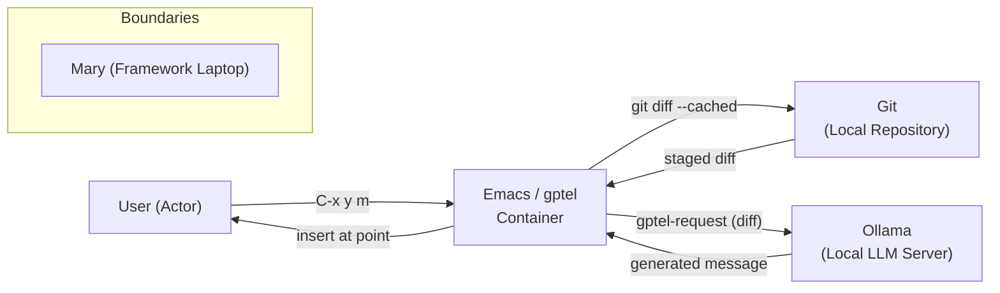

## Context

This change adds a new Emacs command that generates Git commit messages from staged changes using gptel and Ollama. The Emacs config is literate (Emacs.txt → init.el via Org tangle), follows a `local/` prefix convention for custom commands, and already has gptel integrated with Ollama (`qwen2.5-coder:7b`) for AI-assisted tasks. Magit is the established Git interface, and transient menus group related commands.

No existing ADRs constrain this design.

## Goals / Non-Goals

**Goals:**
- Interactive command `local/generate-commit-message` that captures `git diff --cached`, sends it to gptel (Ollama), and inserts the result at point
- Works in magit's `COMMIT_EDITMSG` buffer (primary use case) and any buffer with staged changes
- gptel preset `commit-message` with a system prompt tuned for conventional commit format
- Entry in `local/git-menu` transient

**Non-Goals:**
- No automatic commit or push — message generation only
- No Nix-side changes (model preloading, config) — the model is a standard Ollama pull
- No magit-side hooks or advice — standalone command, composable

## Decisions

### Approach: gptel-request over shelling out to Ollama CLI
Ollama CLI would require parsing JSON or text from a shell command. `gptel-request` is the established pattern (see `local/review-elisp`, `local/translate`) and provides streaming, error handling, and backend abstraction for free.

### Model: qwen2.5-coder:7b over smaller models
Balances response quality with the laptop's ROCm-accelerated GPU memory. 7B fits in ~4-6GB VRAM, fast enough for interactive use. The model choice is configurable via a `defcustom` (matching the `local/elisp-review-llm` pattern).

### UI: Transient menu entry over dedicated keybinding
Consistent with `local/git-menu` (`C-x y`) where magit commands live. The `"m"` key is unclaimed and mnemonic for "message".

### System prompt: Conventional commits
The prompt instructs the LLM to produce structured commit messages (type, scope, subject, body) from the diff, mirroring the project's preferred format.

### Error handling
Three distinct failure modes, each with a user-facing message:
- **No git repo**: `(user-error "Not inside a Git repository")`
- **No staged changes**: `(user-error "No staged changes to commit")`
- **gptel error**: callback's `info` parameter passed to `(message "Error: %s" info)`

## Risks / Trade-offs

- **[Risk] Model quality**: `qwen2.5-coder:7b` may produce inconsistent messages → Mitigation: model is configurable via `defcustom`; user can switch to a different Ollama model or Gemini backend at any time.
- **[Risk] Latency**: 7B model on laptop iGPU takes a few seconds → Mitigation: accept as inherent to LLM-based approach; streaming could be added later.
- **[Risk] No staged changes**: User runs command without staging → Mitigation: explicit error message guides them to stage first.

## Migration Plan

This is additive — no migration needed. Steps:
1. Edit Emacs.txt to add the command, preset, and menu entry
2. Tangle with `ent generate`
3. (Optional) Pull the model: `ollama pull qwen2.5-coder:7b`

Rollback: Remove the added Org blocks and retangle.

## Open Questions

None.
