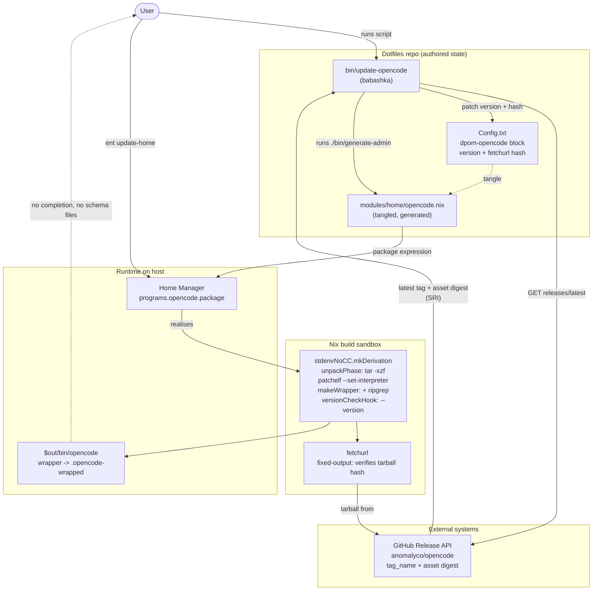

## Context

`dpom-opencode` (the tangle block at `Config.txt:3440-3576` producing `modules/home/opencode.nix`) currently sets only `programs.opencode.enable = true`. Home Manager therefore resolves `programs.opencode.package` to `pkgs.opencode` from the nixpkgs flake input, and the installed agent silently tracks whatever nixpkgs ships. Today that is `1.15.10`; upstream `anomalyco/opencode` is at `v1.18.33`. There is no lever to close that gap: `opencode upgrade` is not usable against a Nix-managed install, and `nix flake update` moves only as fast as nixpkgs.

`bin/update-pi` and `bin/update-ollama` do not have this problem because their packages are explicitly pinned in the literate Org source. `opencode` lacks such a pin, which is the whole reason this change exists.

Two repos are relevant precedent. **ADR-0001 (in force)** already decided, for ollama, to pin prebuilt GitHub release assets rather than track nixpkgs, and **ADR-0004 (in force)** superseded ADR-0002 by lifting the pi version cap through vendored provider model data. ADR-0002 is therefore historical only. ADR-0003 (ollama-cloud provider) and ADR-0005 (pi build order) are in force but do not constrain this design.

The nixpkgs `opencode` recipe is a ~170-line `stdenvNoCC.mkDerivation`: a `bun`/`nodejs` source build, a nested fixed-output `node_modules` derivation hashed by `outputHash` (not `npmDepsHash`), `env.MODELS_DEV_API_JSON` pointed at the `models-dev` package to keep model catalogs out of the build, and a `postPatch` that rewrites upstream's Bun version check into a warning. Reproducing that in a Home Manager module is a substantially larger commitment than the pin itself.

### Verified evidence

Every claim below was established by building against upstream `v1.18.33` on `x86_64-linux`, not inferred:

| Finding | Detail |
| --- | --- |
| Release asset | `opencode-linux-x64.tar.gz`, 60,628,669 bytes, `digest: sha256:e5461232…` present in the GitHub release API |
| Tarball layout | A single top-level `opencode` file, **no directory** — `tar tzf` prints exactly one entry |
| `unpackFile` | Aborts: `unpacker appears to have produced no directories`. An explicit `unpackPhase` is required. |
| ELF interpreter | `/lib64/ld-linux-x86-64.so.2`, which does not exist inside the Nix sandbox, so the binary cannot run unpatched |
| `autoPatchelfHook` | **Corrupts the executable.** Output shrinks 185,354,368 → 185,354,072 bytes and `--version` reports `1.3.14` (the embedded Bun runtime version) instead of `1.18.33` |
| `patchelf --set-interpreter` alone | Preserves the binary: 185,358,464 bytes, `--version` reports `1.18.33` |
| Full derivation | Builds and passes `versionCheckHook`; `opencode --version` → `1.18.33`; `opencode debug config` reads config correctly; `rg` resolves on the wrapped `PATH` |
| `opencode completion` | Fails in the sandbox with `EACCES` then `EEXIST`; not fixed by `writableTmpDirAsHomeHook`, `OPENCODE_VERSION`, `OPENCODE_DISABLE_MODELS_FETCH`, or redirecting `XDG_{DATA,CACHE,STATE,CONFIG}_HOME`. Completions are not obtainable from the prebuilt asset. |

Both hosts are `x86_64-linux`. `dpom-opencode.enable` is set only in `hosts/mary/home.nix:14`, so this pin is mary-scoped in practice.

### Diagram

Container-level, lightweight C4. One script, one Org source of truth, one build sandbox.

Boundary notes: `bin/update-opencode` never deploys and never commits — it ends after re-tangling. The generated `modules/home/opencode.nix` is an output of the script, not an input. The `fetchurl` fixed-output derivation is the only hash-gated step, and it is gated by a digest the script already read from the API, so no hash-discovery build is involved.

## Goals / Non-Goals

**Goals:**

- Pin the opencode version in the literate Org source, so the repo owns the version instead of nixpkgs.
- Provide `bin/update-opencode` to move that pin to the latest `anomalyco/opencode` release on demand.
- Keep the derivation small enough to maintain: no vendored source build, no `models-dev`, no nested fixed-output derivation.
- Guarantee the built package actually runs, via a build-time version check that fails loudly rather than shipping a silently broken binary.

**Non-Goals:**

- Building opencode from source, or reproducing the nixpkgs recipe.
- `aarch64`, `darwin`, or baseline-CPU asset variants.
- Generating `share/opencode/{config,tui}.json` JSON schemas (they come from `packages/opencode/script/schema.ts` in the source tree and are not in the release tarball).
- Shell completions — verified unobtainable from the prebuilt asset in a sandbox.
- Changing the jq-generated `~/.config/opencode/opencode.json`, the `home.activation.generateOpencode` entry, or `bin/update-opencode-models`.
- Automatic deployment or commits.

## Decisions

### D1 — Pin the prebuilt glibc release tarball, not a source build

`fetchurl` the `opencode-linux-x64.tar.gz` asset and pin `version` + `hash` in the `dpom-opencode` block.

This is the pattern ADR-0001 put in force for ollama, and it generalises the `bin/update-oh-my-pi` approach it cites. It is also the only option that keeps the module small: the source build drags in `bun`, `nodejs`, `models-dev`, a `postPatch` that relaxes upstream's own version check, and a nested fixed-output `node_modules` derivation that has to be re-discovered on every bump.

Rejected: **vendor the nixpkgs source recipe.** It is proven to build, but it is ~170 lines of vendored Nix that will drift, its subpackage `outputHash` discovery does not reuse `update-pi`'s `npmDepsHash` fake-hash parser, and each bump would need hand-patching wherever upstream changes `build.ts` flags or env vars — the failure mode ADR-0004 was written to escape for pi. Rejected: **keep tracking nixpkgs**, which is the status quo this change exists to fix.

### D2 — Inject the pin via `programs.opencode.package`, keeping `enable = true`

Assign `programs.opencode.package = opencode` alongside the existing `enable = true`. This is the smallest diff that changes where the binary comes from, and it leaves the module's existing `home.packages = [ generateOpencodeConfig ]` and `home.activation.generateOpencode` wiring untouched.

Rejected: **`home.packages = [ opencode generateOpencodeConfig ]`, the shape `pi.nix` uses at `Config.txt:2815`.** It would drop Home Manager's own `programs.opencode` wiring, including the `settings`/`tui` file management the module currently gets for free, in exchange for consistency with a module that has no separate config-generation concern. Not worth it for a version pin.

### D3 — Unpack with an explicit `unpackPhase`

Override `unpackPhase` to `tar -xzf "$src"`. Verified necessary: the tarball has a single top-level *file* and no directory, so nixpkgs' `unpackFile` refuses it.

Kept in `unpackPhase` rather than folded into `installPhase` so the `preUnpack`/`postUnpack` hooks still run, per Nix convention.

### D4 — One explicit `patchelf --set-interpreter`; `autoPatchelfHook` is forbidden

The binary's interpreter is a host glibc path that does not exist in the sandbox, so it must be repointed at `${stdenv.cc.bintools.dynamicLinker}`. The *only* permitted way to do that is a single explicit `patchelf --set-interpreter` call on the installed binary.

`autoPatchelfHook` must not appear in `nativeBuildInputs`. Verified: it sets the interpreter successfully, then shrinks the binary by 296 bytes and leaves it reporting `1.3.14` — the embedded Bun runtime version — rather than `1.18.33`. The minimal call grows the binary by 4,096 bytes (normal page-alignment padding) and preserves correct behavior. AutoPatchelf's dependency scan and RPATH rewrite are destructive on a Bun single-file executable.

This is the single most fragile constraint in the change and is why D6 exists.

### D5 — Wrap with `makeWrapper --prefix PATH` to prepend `ripgrep`

opencode's grep tool shells out to `rg`. The nixpkgs recipe wraps the same way. Without this, the tool silently degrades.

### D6 — `versionCheckHook` + `doInstallCheck` as the corruption tripwire

`doInstallCheck = true` with `versionCheckProgramArg = "--version"` and `meta.mainProgram = "opencode"`. This is what caught the `autoPatchelfHook` regression during design, and it is the mechanism that will catch any future corruption introduced by a bun release changing the binary's internal layout. Without it, D4's constraint would degrade into folklore within one bump.

### D7 — `bin/update-opencode` in babashka, hashing from the GitHub API `digest`

Resolve the latest `anomalyco/opencode` release, read the `digest` field of the `opencode-linux-x64.tar.gz` asset, convert it to SRI with `nix hash convert --to sri`, and patch `version` + `hash` into the `Config.txt` block, then re-tangle via `./bin/generate-admin`.

This is the `update-ollama` mechanism from ADR-0001, and babashka is the language both `update-ollama` and `update-pi` use. Crucially, the asset `digest` is verified present in the release API, so the script needs **no hash-discovery build** — unlike `update-pi`, whose `npmDepsHash` cannot be derived from the source tarball. The `curl | sha256sum` fallback from `update-ollama` is retained for when upstream omits `digest`.

Rejected: **`nix-prefetch-url`**, which is what `update-pi` uses for source hashes. Redundant given the API digest, and it would mean downloading a 60 MB asset on every run instead of a few hundred bytes of JSON.

### D8 — Idempotent, stops before deploy, no `.ent.el` task

If the resolved version already equals the pinned one, report and exit without touching files. The script never runs `home-manager switch` or `nix`, and never commits; it prints the manual next steps. No `.ent.el` task, for consistency with `update-pi` and `update-ollama`, neither of which has one.

## Risks / Trade-offs

- **A future bun release changes the binary layout and `patchelf` corrupts it again** -> D6's install check fails the build loudly rather than shipping a broken binary; the fix is a manual `postPatch`, never a silent `autoPatchelfHook`.
- **Upstream renames the release asset or drops the API `digest` field** -> fall back to download + `sha256sum`; if that also fails, hard-fail with a message naming the expected asset, matching `update-ollama`'s handling.
- **A future release stops shipping a bare single-file tarball** -> the D3 `unpackPhase` breaks loudly at build time. The script should also verify the asset exists before patching.
- **Loses `share/opencode/{config,tui}.json` JSON schemas** -> no runtime impact, since the config is jq-generated; editor-side schema validation for `opencode.json` is lost. Accepted, documented, revisit only if it becomes annoying.
- **Loses shell completions** -> verified unobtainable (see evidence table). This is a real regression against the nixpkgs-installed binary. Accepted for now; tracked below.
- **The repo now owns currency** -> no automatic nixpkgs security updates. Accepted, consistent with ADR-0001's stated consequence for ollama. `bin/update-opencode` is the mitigation.
- **x86_64-linux glibc only** -> both current hosts qualify. A new aarch64 or darwin host would need additional variants; the `acceleration`-style option pattern in `modules/nixos/ollama.nix:93` is the model if that becomes real.
- **Deviates from the literate source-of-truth convention** -> the module keeps the pin in `Config.txt` and only tangles, so this design does *not* repeat the divergence ADR-0001 notes for `bin/update-oh-my-pi`.

## Migration Plan

1. Add the `opencode` package definition (pinned `version`, `fetchurl` `hash`, D3/D4/D5/D6) to the `dpom-opencode` tangle block in `Config.txt`, and assign `programs.opencode.package`.
2. Tangle: `./bin/generate-admin`. Confirm `modules/home/opencode.nix` matches.
3. Apply: `ent update-home`.
4. Verify: `opencode --version` reports the pinned version, `opencode debug config` reads the generated config, and a grep-style tool call resolves `rg`.
5. Add `bin/update-opencode` and confirm it is a clean no-op against the new pin.
6. Commit `Config.txt`, the generated `modules/home/opencode.nix`, and `bin/update-opencode` together, per the repo's tangle-first convention.

Rollback is a one-line revert: drop the `programs.opencode.package` assignment, re-tangle, `ent update-home`. The module then falls back to `pkgs.opencode` with no other residue.

## Open Questions

- **Shell completions.** `opencode completion` exits nonzero in the sandbox and writes no output, apparently because of the sqlite database migration observed at every `opencode` startup (`EACCES`, then `EEXIST` once `HOME` is writable). Four mitigations were tried and failed. Is chasing this worth it, or is losing completions acceptable for a tool whose config is generated by `jq` anyway? Deferred pending a decision.
- **Which x64 asset suits mary?** The non-baseline asset's bun runtime self-identifies as `Linux x64 baseline`, which is confusing. Worth confirming mary's CPU against upstream's baseline requirements before assuming `opencode-linux-x64.tar.gz` is always correct.
- **Should bob also enable `dpom-opencode`?** Out of scope, but the pin is host-agnostic, so enabling it later is a one-line change.
- **ADR for the bun/patchelf constraint.** The `autoPatchelfHook` corruption (D4) is the kind of durable, non-obvious constraint that belongs in `adr/`, because the next person to "clean up" the derivation will reach for `autoPatchelfHook` and silently break the package. Recommend the `adr` step record this. It does not revise ADR-0001, which supports this design.
- **Schema files.** If editor validation of `opencode.json` proves painful, the schemas could be vendored into the repo from a known release rather than generated at build time. Not now.
